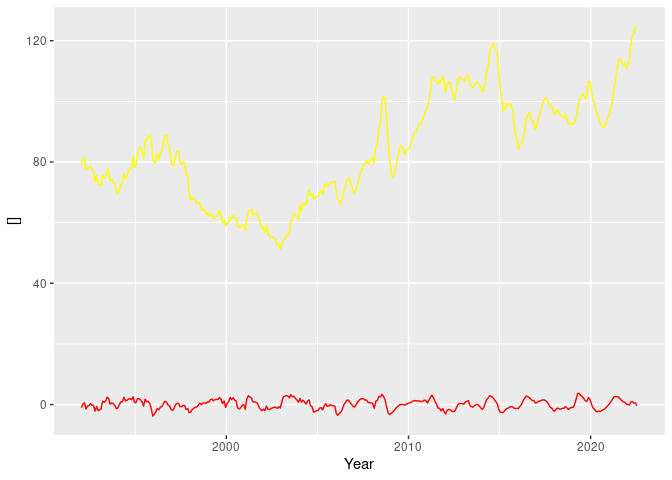

## FAO Food Price Index

Download the food price data from FAO (monthly)

# https://www.fao.org/worldfoodsituation/foodpricesindex/en/
# https://www.fao.org/fileadmin/templates/worldfood/Reports_and_docs/Food_price_indices_data_may629.csv


```sh
echo $(pwd)
#cd ./sh & ./foaFood.sh
/cre/R/sh/foaFood.sh
#./sh/foaFood.sh
```

```
## /__w/faoFood/faoFood
## PWD: /__w/faoFood/faoFood
## touch: cannot touch './download/plain2.txt': No such file or directory
## match: '_aug580'
## Try to download: https://www.fao.org/fileadmin/templates/worldfood/Reports_and_docs/Food_price_indices_data_aug580.csv
## --2022-08-31 12:08:10--  https://www.fao.org/fileadmin/templates/worldfood/Reports_and_docs/Food_price_indices_data_aug580.csv
## Resolving www.fao.org (www.fao.org)... 172.64.147.129, 104.18.40.127, 2606:4700:4400::ac40:9381, ...
## Connecting to www.fao.org (www.fao.org)|172.64.147.129|:443... connected.
## HTTP request sent, awaiting response... 200 OK
## Length: 43280 (42K) [text/csv]
## Saving to: ‘../download/Food_price_indices_data_aug580.csv’
## 
##      0K .......... .......... .......... .......... ..        100% 16.4M=0.003s
## 
## 2022-08-31 12:08:10 (16.4 MB/s) - ‘../download/Food_price_indices_data_aug580.csv’ saved [43280/43280]
```


```r
food <- read.csv("./download/foaFood.csv", sep=",")
# first remove columns with completely empty values
food2 <- food[,colSums(is.na(food))<nrow(food)]
# second keep complete rows
food3 <- food2[complete.cases(food2[ , 1:7]),]
# third remove columns with some empty values
food <- food3[,colSums(is.na(food3))==0] 

food$time <- paste(food$Date, '15 00:00:00', sep='-')
food$year <- strtoi(substr(food$Date, 1, 4), base=10)
food$month <- strtoi(substr(food$Date, 6, 7), base=10)
food$ts <- signif(food$year + (food$month-0.5)/12, digits=6)
food$Date <- NULL
food <- food[order(food$ts),]

write.table(food, file = "./csv/monthly_abs_food_index.csv", append = FALSE, quote = TRUE, sep = ",",
            eol = "\n", na = "NA", dec = ".", row.names = FALSE,
            col.names = TRUE, qmethod = "escape", fileEncoding = "UTF-8")
```


## Plot Absolute Food Index


```r
require("ggplot2")
```

```
## Loading required package: ggplot2
```

```r
food <- read.csv("./csv/monthly_abs_food_index.csv", sep=",")
mp <- ggplot() +
      geom_line(aes(y=food$Food.Price.Index, x=food$ts), color="black") +
      geom_line(aes(y=food$Meat, x=food$ts), color="red") +
      geom_line(aes(y=food$Dairy, x=food$ts), color="blue") +
      geom_line(aes(y=food$Cereals, x=food$ts), color="cyan") +  
      geom_line(aes(y=food$Oil, x=food$ts), color="yellow") +  
      geom_line(aes(y=food$Sugar, x=food$ts), color="green") +  
      xlab("Year") + ylab("[]")
mp
```

<!-- -->


```r
#install.packages("rollRegres")
library(rollRegres)

# data <- food
# wid <- 24

rollingGLM <- function(data, wid) {
  py4 <-  data
  reg <- roll_regres(Meat ~ ts, data, width = wid, do_compute=c('sigmas', '1_step_forecasts')) 
  #reg <- roll_regres(temperature ~ year, py4, width = wid, do_compute=c('sigmas'))
  lapply(reg, tail)
  py4$ind <- (py4$Meat - reg$one_step_forecasts)/reg$sigmas  
  py4$ind <- signif(py4$ind, digits=6)
  #py4$ind2 <- (py4$temperature - py4$year*reg$coefs[,2]+reg$coefs[,1])/reg$sigmas
  
  py4 <-tail(py4, n=-wid)
  return(py4) 
}  

#reg <- roll_regres(meat ~ ts, data, width = 12, do_compute=c('sigmas', '1_step_forecasts')) 
#xx <- reg$coefs
#xx['ts']

mil12 <- rollingGLM(food,24)
```


## Plot Relative Food Index


```r
require("ggplot2")
food2 <- mil12
mp <- ggplot() +
      #geom_line(aes(y=food$Food.Price.Index, x=food$ts), color="black") +
      geom_line(aes(y=food2$Meat, x=food2$ts), color="yellow") +
      geom_line(aes(y=food2$ind, x=food2$ts), color="red") +
      #geom_line(aes(y=food$Dairy, x=food$ts), color="blue") +
      #geom_line(aes(y=food$Cereals, x=food$ts), color="cyan") +  
      #geom_line(aes(y=food$Oil, x=food$ts), color="yellow") +  
      #geom_line(aes(y=food$Sugar, x=food$ts), color="green") +  
      xlab("Year") + ylab("[]")
mp
```

<!-- -->


